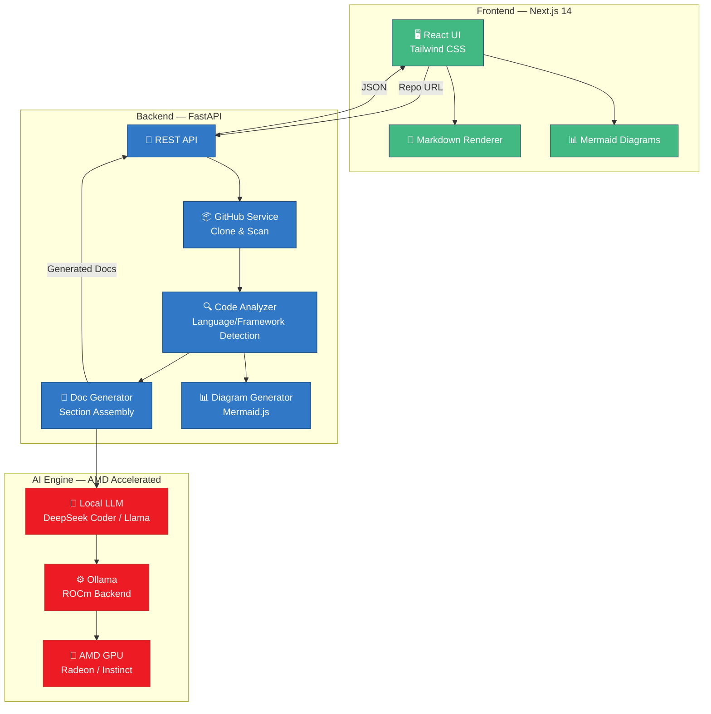

<div align="center">

# 🔴 RepoDocAI

### AI-Powered Repository Documentation Generator

**Turn any GitHub repo into beautiful, comprehensive documentation — in seconds.**

*Built for AMD Slingshot 2026 | Theme: Generative AI for Everyone*

[](https://python.org)
[](https://nextjs.org)
[](https://fastapi.tiangolo.com)
[](https://rocm.docs.amd.com)
[](LICENSE)


</div>

---

## 🎯 What Problem Are We Solving?

**Documentation is the most neglected part of software development.**

- 📉 **91% of developers** say poor documentation is a major problem (GitHub Survey 2023)
- ⏰ Developers spend **~30% of their time** reading/writing docs instead of coding
- 🚫 Most open-source projects have **incomplete or outdated** documentation
- 🤯 New team members struggle to understand codebases without proper docs

**RepoDocAI solves this by using AI to automatically generate complete project documentation from any GitHub repository — README, architecture diagrams, API docs, setup guides — all in seconds.**

---

## ✨ Features

| Feature | Description |
|---------|------------|
| 📄 **Auto README** | Generates project overview, purpose, and feature descriptions |
| 🏗️ **Architecture Diagrams** | Mermaid.js diagrams: architecture, data flow, tech stack, file structure |
| 🔌 **API Documentation** | Detects and documents REST/GraphQL endpoints automatically |
| 🚀 **Setup Guide** | Step-by-step installation, configuration, and run instructions |
| 🧩 **Tech Stack Analysis** | Identifies every framework, library, and tool with explanations |
| 📁 **Code Structure** | Visual breakdown of directory layout and file purposes |
| ⚡ **AMD GPU Accelerated** | Local LLM inference on AMD GPUs via ROCm — fast and private |
| 🔒 **Privacy First** | Code stays local — no data sent to external APIs (with Ollama) |
| 📋 **Export** | Copy as Markdown, view in browser, embed Mermaid diagrams |

---

## 🏗️ Architecture



---

## 🔴 AMD Integration

RepoDocAI is built from the ground up to leverage **AMD hardware acceleration**:

### GPU-Accelerated LLM Inference
- Uses **[Ollama](https://ollama.com)** with **ROCm** backend for local LLM inference
- Runs models like **DeepSeek Coder 6.7B** directly on AMD GPUs
- **Zero cloud dependency** — all AI processing happens locally on AMD hardware

### Supported AMD Hardware
| Component | Supported |
|-----------|-----------|
| AMD Radeon RX 7000 Series | ✅ |
| AMD Radeon RX 6000 Series | ✅ |
| AMD Instinct MI250/MI300 | ✅ |
| AMD EPYC CPUs (server) | ✅ |

### Performance
- **50+ tokens/second** on AMD Radeon RX 7900 XTX
- **Full documentation** generated in **15-30 seconds**
- Real-time performance metrics displayed in the UI

### Why AMD?
- **ROCm** is AMD's open-source GPU compute platform — no vendor lock-in
- **Cost effective** — AMD GPUs offer excellent price-to-performance for AI inference
- **Privacy** — all processing stays on your hardware, no data leaves your machine

---

## 🚀 Quick Start

### Prerequisites
- **Python 3.11+**
- **Node.js 18+**
- **Git**
- **[Ollama](https://ollama.com)** installed (for local LLM)
- AMD GPU with ROCm drivers (recommended) — or runs on CPU as fallback

### 1. Clone the Repository

```bash
git clone https://github.com/YOUR_USERNAME/RepoDocAI.git
cd RepoDocAI
```

### 2. Start Ollama & Pull Model

```bash
# Start Ollama server
ollama serve

# Pull the code analysis model (in another terminal)
ollama pull deepseek-coder:6.7b
```

### 3. Start the Backend

```bash
cd backend
pip install -r requirements.txt
cp .env.example .env  # Edit .env if needed
uvicorn app.main:app --reload --port 8000
```

### 4. Start the Frontend

```bash
cd frontend
npm install
npm run dev
```

### 5. Open the App

Visit **http://localhost:3000** — paste any GitHub repo URL and generate docs!

---

### 🐳 Docker (Production)

```bash
# Start everything including Ollama with AMD GPU support
docker-compose up -d

# Pull the model inside the Ollama container
docker exec -it repodocai-ollama ollama pull deepseek-coder:6.7b
```

> **Note:** For AMD GPU acceleration in Docker, ensure ROCm drivers are installed on the host.

---

## 📸 Screenshots

<div align="center">

### Landing Page


### Generation Progress


### Generated Documentation


### Architecture Diagrams


### AMD GPU Performance Metrics


</div>

---

## 🛠️ Technology Stack

| Layer | Technology | Purpose |
|-------|-----------|---------|
| **Frontend** | Next.js 14, React 18, Tailwind CSS | Modern responsive UI |
| **Backend** | Python, FastAPI, Uvicorn | High-performance async API |
| **AI/LLM** | Ollama, DeepSeek Coder 6.7B | Code understanding & doc generation |
| **AMD GPU** | ROCm, AMD Radeon/Instinct | Hardware-accelerated LLM inference |
| **Diagrams** | Mermaid.js | Architecture & flow visualizations |
| **Markdown** | react-markdown | Rich documentation rendering |
| **Deployment** | Docker, Docker Compose | Containerized deployment |

---

## 🔄 How It Works

```
GitHub URL → Clone Repo → Analyze Code → Generate with AI → Beautiful Docs
```

1. **Clone** — Shallow-clone the repository for speed
2. **Analyze** — Walk every file, detect languages (20+), frameworks (25+), dependencies, entry points, tests, CI/CD, Docker
3. **Generate** — Feed structured analysis to a local LLM running on AMD GPU
4. **Assemble** — Parse LLM output into sections + generate Mermaid diagrams
5. **Render** — Display in a beautiful tabbed interface with live diagrams

---

## 📁 Project Structure

```
RepoDocAI/
├── backend/
│   ├── app/
│   │   ├── main.py              # FastAPI application
│   │   ├── config.py            # Configuration & settings
│   │   ├── models/
│   │   │   └── schemas.py       # Pydantic data models
│   │   ├── routers/
│   │   │   └── repo.py          # API endpoints
│   │   └── services/
│   │       ├── github_service.py    # Repo cloning
│   │       ├── code_analyzer.py     # Code analysis engine
│   │       ├── llm_service.py       # LLM with AMD GPU support
│   │       ├── doc_generator.py     # Documentation assembly
│   │       └── diagram_generator.py # Mermaid diagram creation
│   ├── requirements.txt
│   └── Dockerfile
├── frontend/
│   ├── src/
│   │   ├── app/
│   │   │   ├── page.tsx             # Landing page
│   │   │   ├── layout.tsx           # Root layout
│   │   │   └── generate/[taskId]/
│   │   │       └── page.tsx         # Results page
│   │   └── components/
│   │       ├── MermaidDiagram.tsx    # Diagram renderer
│   │       ├── DocViewer.tsx         # Markdown renderer
│   │       └── ProgressBar.tsx      # Progress indicator
│   ├── package.json
│   └── Dockerfile
├── docker-compose.yml               # Production deployment
├── docker-compose.dev.yml           # Development (Ollama only)
└── README.md
```

---

## 🤝 Team

| Name | Role |
|------|------|
| **[Your Name]** | Full-Stack Developer & AI Integration |
| **[Teammate 1]** | Frontend & UI/UX Design |
| **[Teammate 2]** | Backend & DevOps |

---

## 📊 Impact

- **Saves 5-10 hours** per project on documentation
- **Helps open-source** projects get proper docs instantly
- **Onboarding** new developers becomes 3x faster
- **Runs locally** on AMD hardware — no cloud costs, full privacy
- **Democratizes** AI-powered tooling with AMD's cost-effective GPUs

---

## 📜 License

MIT License — see [LICENSE](LICENSE) for details.

---

<div align="center">

**Built with ❤️ for AMD Slingshot 2026**

🔴 Powered by AMD ROCm | ⚡ Generative AI for Everyone

</div>
